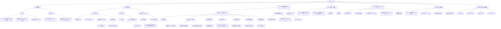

```mermaid
graph TD
  A[スキルメータ] --> B1[1. 機能概要]
  B1 --> C1a[目的]
  C1a --> D1a1[ユーザー自身のスキル全体把握]
  C1a --> D1a2[視覚的なアピール/プロフィール強調]
  C1a --> D1a3[入力促進・モチベート]
  B1 --> C1b[利用シーン]
  C1b --> D1b1[ユーザー向けダッシュボード]
  C1b --> D1b2[管理者によるタレントマネジメント支援]

  A --> B2[2. UI/UX構成]
  B2 --> C2a[メータ表示部]
  C2a --> D2a1[指標タイトル]
  C2a --> D2a2[ゲージ（針orバー）]
  C2a --> D2a3[数値表示（0～100）]
  C2a --> D2a4[背景色切替]
  D2a4 --> E2a4r[赤（50未満）]
  D2a4 --> E2a4y[黄（50以上80未満）]
  D2a4 --> E2a4g[緑（80以上）]
  B2 --> C2b[サマリ部]
  C2b --> D2b1[ユーザ名]
  C2b --> D2b2[スコア（履歴比較）]
  B2 --> C2c[詳細部（子メータ）]
  C2c --> D2c1[スキル充実度]
  C2c --> D2c2[キャリア充実度]

  A --> B3[3. スキル充実度の算出ロジック]
  B3 --> C3a[情報フィールド設定カバレッジ]
  C3a --> D3a1[指定資格]
  D3a1 --> E3a1a[資格名/取得日/証明書番号など]
  D3a1 --> E3a1b[複数入力→1つでも加算]
  C3a --> D3a2[指定ドメイン知識]
  D3a2 --> E3a2a[業務領域・業界知識]
  D3a2 --> E3a2b[選択式or自由記述or複合]
  C3a --> D3a3[指定品質技術]
  D3a3 --> E3a3a[品質管理手法等]
  C3a --> D3a4[指定ITスキル]
  D3a4 --> E3a4a[プログラミング言語/フレームワーク/ツール]
  C3a --> D3a5[その他の資格]
  D3a5 --> E3a5a[業務外資格・自由記入]
  C3a --> D3a6[その他得意分野]
  D3a6 --> E3a6a[補足記述・自由入力]
  C3a --> D3a7[別分野専門性]
  D3a7 --> E3a7a[語学・運営など]
  B3 --> C3b[特記事項記載状況]
  C3b --> D3b1[受賞・著作・講演]
  C3b --> D3b2[文字数カウント/ポイント付与]
  C3b --> D3b3[バリデーション]
  B3 --> C3c[合計最大ポイント]

  A --> B4[4. スコア集計・標準化]
  B4 --> C4a[キャリア充実度と組み合わせ]
  B4 --> C4b[算出式:（スキル充実度+キャリア充実度）÷2]
  B4 --> C4c[四捨五入]
  B4 --> C4d[UI連携]

  A --> B5[5. データ保存・バリデーション]
  B5 --> C5a[必須/任意判定]
  B5 --> C5b[0～200文字制限]
  B5 --> C5c[入力不能時フィードバック]
  B5 --> C5d[DB反映タイミング/トランザクション]
  B5 --> C5e[更新履歴管理]

  A --> B6[6. 拡張性・将来展開]
  B6 --> C6a[フィールド追加時ポイント配分]
  B6 --> C6b[アドバンスド・メータ]
  B6 --> C6c[部分伸長の可視化]
  B6 --> C6d[外部評価との連携]

  A --> B7[7. 開発・運用上の考慮事項]
  B7 --> C7a[テスト観点]
  B7 --> C7b[パフォーマンス]
  B7 --> C7c[セキュリティ]
  B7 --> C7d[ユーザビリティ]
```